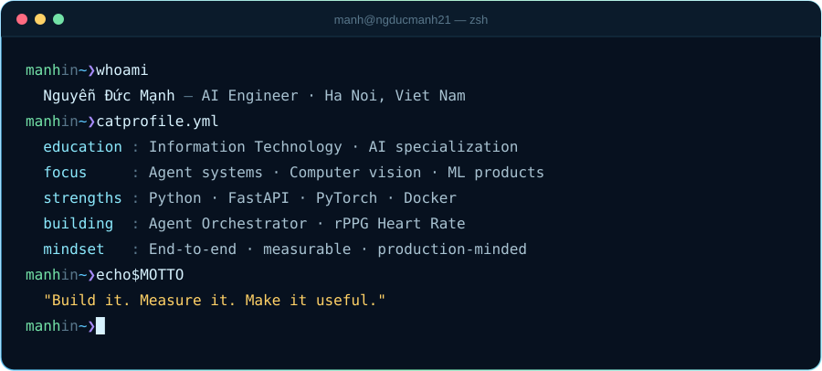

<!-- ============================== HERO ============================== -->

  

  

  
  
  
   
  
  
  

<!-- ============================== ABOUT ============================== -->
## 👋 About Me

I'm an Information Technology student in Vietnam, specializing in **Artificial Intelligence**. I enjoy taking ideas all the way from a model or agent workflow to a product people can actually use — with APIs, interfaces, tests, deployment and measurable behavior.

My current work sits at the intersection of **agentic AI**, **computer vision** and **backend engineering**. I am especially interested in AI/ML engineering roles where research thinking and solid software engineering matter equally.

  

## ⚡ What I Bring

<table>
  <tr>
    <td width="33%" valign="top">
      <h3>🤖 AI Systems</h3>
      Agent orchestration, RAG, MCP integrations, vector search and practical LLM workflows that connect to real tools and data.
    </td>
    <td width="33%" valign="top">
      <h3>👁️ Computer Vision</h3>
      Video pipelines, face processing, physiological signal estimation and explainable vision-language experimentation.
    </td>
    <td width="33%" valign="top">
      <h3>🛠️ Product Engineering</h3>
      FastAPI services, React interfaces, WebSockets, Docker and observability — built with usability and operations in mind.
    </td>
  </tr>
</table>

<!-- ============================== PROJECTS ============================== -->
## 🚀 Featured Projects

<table>
  <tr>
    <td width="50%" valign="top">
      <h3>🤖 <a href="https://github.com/ngducmanh21/Agent_orchestrator">Agent Orchestrator</a></h3>
      An AI engineering workspace that indexes legacy codebases into Qdrant, explains files, searches code semantically and turns change requests into BA/SA impact plans. It also exposes the knowledge base and file operations through an MCP server for coding agents.  
      
      
      
      
      
    </td>
    <td width="50%" valign="top">
      <h3>❤️ <a href="https://github.com/ngducmanh21/RPPG_Estimation_Web">Contactless Heart-Rate Estimation</a></h3>
      An end-to-end rPPG web app that estimates heart rate from webcam or uploaded face video. The MTTS-CSTM pipeline returns BPM, confidence, SNR and a PPG waveform, with runtime metrics exposed through REST and WebSocket APIs.  
      
      
      
      
      
    </td>
  </tr>
  <tr>
    <td width="50%" valign="top">
      <h3>🌱 <a href="https://github.com/ngducmanh21/GreenBIM-Analytics">GreenBIM Analytics</a></h3>
      <b>MVP in progress.</b> A Vietnam-focused carbon analytics product that maps construction BOQ spreadsheets to emission factors, evaluates what-if material substitutions and turns the result into decision-ready reports.  
      
      
      
      
    </td>
    <td width="50%" valign="top">
      <h3>📈 <a href="https://github.com/ngducmanh21/Data-Observability-Lineage-Lab">Data Reliability Game Day</a></h3>
      A hands-on reliability lab for detecting silent data failures through contracts, dbt tests, anomaly detection, lineage, SLOs and incident response — because a pipeline marked “SUCCESS” can still produce wrong data.  
      
      
      
      
    </td>
  </tr>
</table>

  Also exploring explainable medical VQA, model serving, LLM evaluation, responsible AI and competitive programming.

<!-- ============================== TECH ============================== -->
## 🧰 Technical Toolkit

<table align="center">
  <tr>
    <td align="right"><b>Languages</b></td>
    <td></td>
  </tr>
  <tr>
    <td align="right"><b>AI &amp; Vision</b></td>
    <td>
       
      
      
      
      
    </td>
  </tr>
  <tr>
    <td align="right"><b>Backend &amp; Web</b></td>
    <td></td>
  </tr>
  <tr>
    <td align="right"><b>Data &amp; Infra</b></td>
    <td></td>
  </tr>
</table>

<!-- ============================== ACTIVITY ============================== -->
## 📊 GitHub Activity

  

  
  

  

  

<!-- ============================== CTA ============================== -->

<h2 align="center">Let's build something useful with AI.</h2>

  If you're hiring for AI/ML engineering, computer vision or AI product roles, I'd be happy to connect.  
  
  

  

